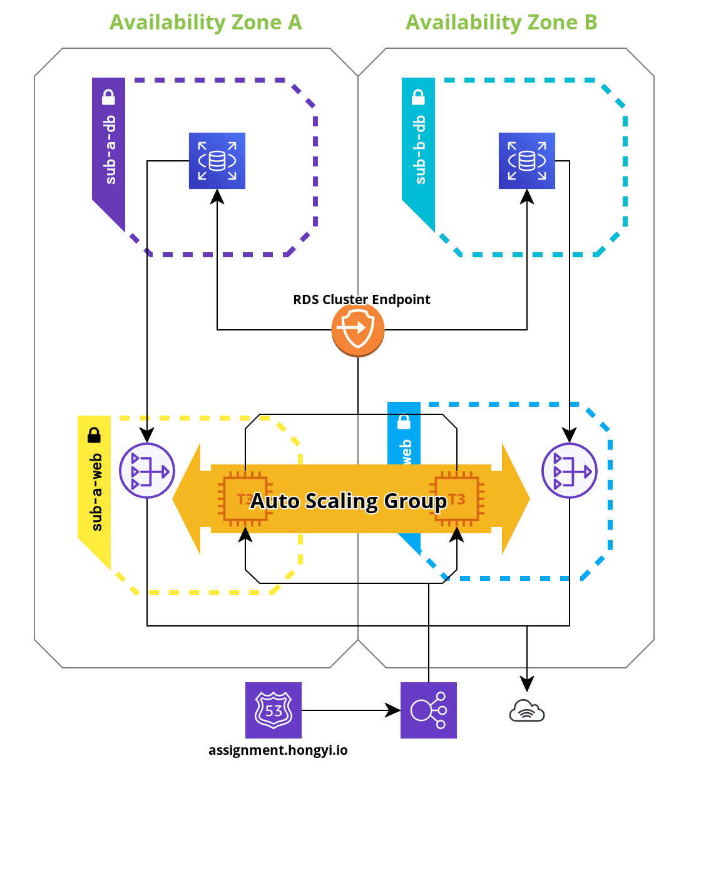

# Symbiosis IAC

The application can be accessed at `http://assignment.hongyi.io`.

The application used in this assignment is a Golang CRUD application which is from `https://www.golangprograms.com/example-of-golang-crud-using-mysql-from-scratch.html`.

## Architecture

The architecture is shown in the diagram below:

The RDS Cluster endpoint will always point to the primary instance as we are using the writer endpoint.

IAM roles were also implmented to allow the EC2 instances to download any required files from the bucket without requiring authentication.

## Developer's enviroment

The developer will require mysql/mariadb server and node to run the web application locally to do development after which the developer is only required to push the code without the database password as this will be pulled by the user data during the provisioning of the instance.

## CI/CD Workflow

The developer will push his/her code to a git repository and after the building of the application is successful, the code will be automatically deployed to a S3 bucket afterwhich the number of instances can be scaled up to deploy instances with the newer version of the application before scaling down again so that the older instances are terminated while still maintaining high availability.

There is also a `userdata` that will download the application files from the S3 bucker and run the application.
